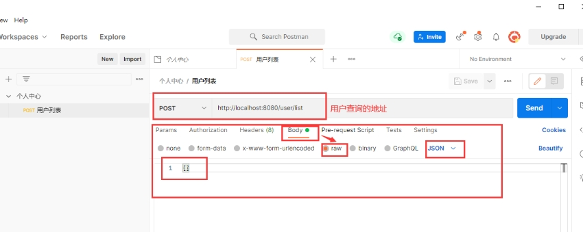
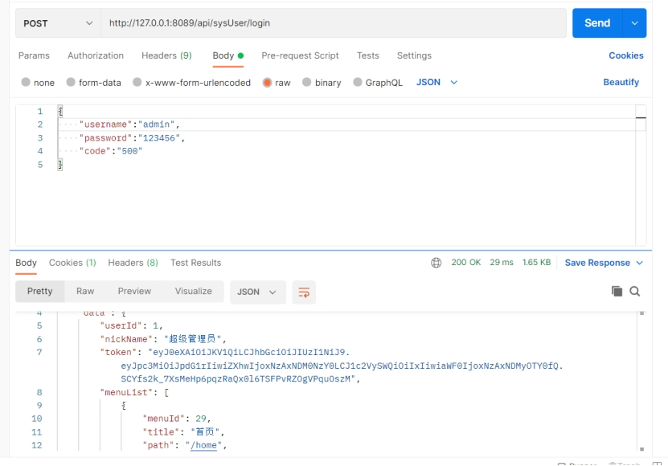
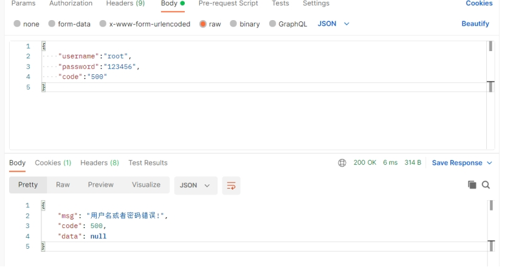
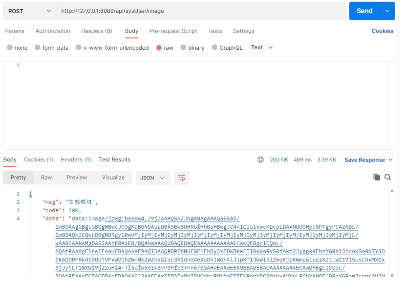

# Back-end interface testing

We mainly use Postman for interface testing. Postman is an interface testing tool that acts as a client when conducting interface testing. It can simulate various HTTP requests initiated by users, send request data to the server, obtain corresponding response results, verify whether the result data in the response matches the expected value, and ensure that developers can handle interface bugs in a timely manner, thereby ensuring the stability and security of the product after it goes online. It is mainly used to simulate various HTTP requests (such as: get/post/delete/put...). The difference between Postman and browsers is that some browsers cannot output JSON format, while Postman provides a more intuitive interface for the returned results.

 

 

## Login password correct

 

## Login password error

 

 

 
